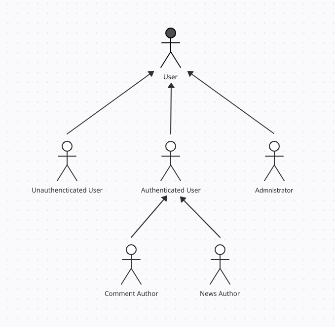

# A2: Actors and User stories

## 1. Actors

Figure 1: Actors

| Identifier           | Description                                                                                                                                         | Examples                    |
| -------------------- | ------------------------------------------------------------------------------------------------------------------------------------------------------------ | --------------------------- |
| User                 | Generic User; Has acess to public information such as view top news fedd, recent news, comments and search for other news or comments| n/a                         |
| Unauthenticated User | Can register itself or authenticate in the system.                                                                                                           | n/a                         |
| Authenticated User   | Can view news and comments, details from news and comments. Can create news and comments, view news categories, search and rate. Follow/Unfollow tags and Users. Can see the profile created and statistics| Alfredocosta                  |
| News Author           | Can edit or delete news created by himself| Alfredocosta                 |
| Comment Author     | Can edit or delete comment created by himself | Alfredocosta                      |
| Administrator               | Responsible for not only the management of the page , such as news and users but also some specific supervisory and moderation functions, such as delete offensive comments and users | admin |

Table 1: Actor's description

 
 

## 2. User Stories

**User**

| Identifier | Name                                                | Priority | Description                                                                                                                          |
|------------|-----------------------------------------------------|----------|--------------------------------------------------------------------------------------------------------------------------------------|
| US01       | View Top News Feed                                          | high     ||
| US02       | View Recent News Feed                               | high     ||
| US03       | View News Item                               | high     ||
| US04       | View News Comments                        | high     ||
| US05       | Search For News Items and Comments                                         | high     ||
| US06       | Contact page                                        | medium   ||
| US07       | FAQ Page                    | medium   ||
| US09       | About Page                                          | medium   ||

Table 2: User's user stories

**Unauthenticated User**

| Identifier | Name                       | Priority | Description                                                                                                                                         |
| ---------- | -------------------------- | -------- | --------------------------------------------------------------------------------------------------------------------------------------------------- |
| US13       | Sign In                    | high     ||
| US14       | Sign Up                    | high     ||
| US15       | Sign In using external API | low      ||
| US16       | Sign Up using external API | low      ||

Table 3: Unauthenticated user's user stories

**Authenticated User**

| Identifier | Name                                   | Priority | Description                                                                                                                                                 |
|------------|----------------------------------------|----------|-------------------------------------------------------------------------------------------------------------------------------------------------------------|
| US17       |  Homepage                        | high     ||
| US18       |  View News Details                     | high    ||
| US19       |  View Comments Details                 | high     ||
| US20       |  Create News Item                        | high    ||
| US21       |  Create Comment Item                           | high     ||
| US22       |  View News Category                      | high     ||
| US23       | Delete account                         | high     ||
| US24       | Search News/Categorys/Usernames                      | high     ||
| US25       | Rate News/Comments (Create, Change, Remove)                   | high     ||
| US26       | View Profile             | high     ||
| US27       | Sign Out                               | high     ||
| US28       | View Other User Profile                        | medium     ||
| US29       | Report Comment  | medium      ||
| US30       | Follow/Unfollow Users       | medium      ||
| US31     | Follow/Unfollow Tags     | medium     ||
| US32     | Follow/Unfollow Tags     | medium      ||
| US33    | Filter News    | medium      ||
| US34    | See statistics    | medium      ||

Table 4: Authenticated user's user stories

**NEWS AUTHOR**

| Identifier | Name                               | Priority | Description                                                                                                     |
|------------|------------------------------------|----------|-----------------------------------------------------------------------------------------------------------------|
| US35       | Edit News Item          |
| US36       | Delete News Item                       | high     | As a Buyer, I want to make an item's review, so that other users have an idea about the quality of the product. |

Table 5: NEWS AUTHOR's user stories

**COMMENT AUTHOR**

| Identifier | Name                               | Priority | Description                                                                                                     |
|------------|------------------------------------|----------|-----------------------------------------------------------------------------------------------------------------|
| US37       | Edit Comment Item | high     ||
| US38       | Delete Comment Item                       | high     ||

Table 6: COMMENT AUTHOR's user stories

**Administrator**

| Identifier | Name                  | Priority | Description                                                                                                           |
|------------|-----------------------|----------|-----------------------------------------------------------------------------------------------------------------------|
| US39       | Sign Out              | high    ||
| US40       | Accept User         | high     ||
| US41       | Ban User         | high     ||
| US42       | Remove Comments      | high    ||
| US43       | Add Category          | high    ||
| US44       | Archive Category      | high     ||
| US45       | Add FAQ               | medium   ||
| US46       | Delete FAQ            | medium   ||
| US47       | View reported reviews | low      ||

Table 7: Administrator's user stories

## 3. Annex: Supplementary requirements

**Business Rules**

| Identifier | Name          | Description                                                                            |
|------------|---------------|----------------------------------------------------------------------------------------|
| BR01       |||    
| BR02       |||
| BR03       |||
| BR04       |||

**Technical Restrictions**

| Identifier | Name            | Description                                                                                                                                                        |
| ---------- | --------------- | ------------------------------------------------------------------------------------------------------------------------------------------------------------------ |
| TR01       | Availability    | The system must be available 99 percent of the time in each 24-hour period                                                                                         |
| TR02       | Accessibility   | The system must ensure that everyone can access the pages, regardless of whether they have any handicap or not, or the Web browser they use                        |
| TR03       | Usability       | The system should be simple and easy to use                                                                                                                        |
| TR04       | Performance     | The system should have response times shorter than 2s to ensure the user's attention                                                                               |
| TR05       | Web application | The system should be implemented as a Web application with dynamic pages (HTML5, JavaScript, CSS3 and PHP)                                                         |
| TR06       | Portability     | The server-side system should work across multiple platforms (Linux, Mac OS, etc.)                                                                                 |
| TR07       | Database        | The PostgreSQL database management system must be used, with a version of 11 or higher.                     |
| TR08       | Security        | The system shall protect information from unauthorised access through the use of an authentication and verification system                                         |
| TR09       | Robustness      | The system must be prepared to handle and continue operating when runtime errors occur                                                                             |
| TR10       | Scalability     | The system must be prepared to deal with the growth in the number of users and their actions                                                                       |
| TR11       | Ethics          | The system must respect the ethical principles in software development (for example, the password must be stored encrypted to ensure that only the owner knows it) |

**Restrictions**

| Identifier | Name     | Description                                                       |
| ---------- | -------- | ----------------------------------------------------------------- |
| C01        | Deadline | The system should be ready to be used at the end of the semester. |
