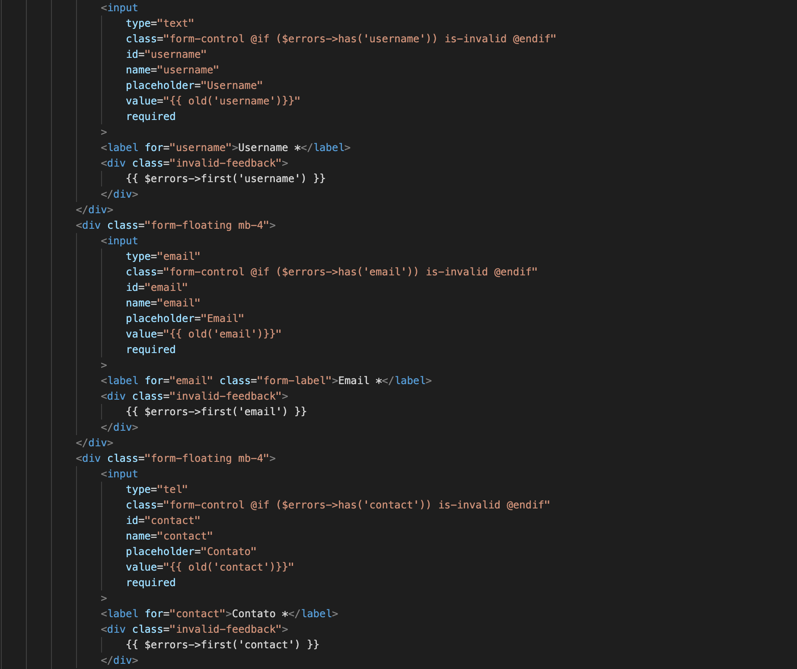
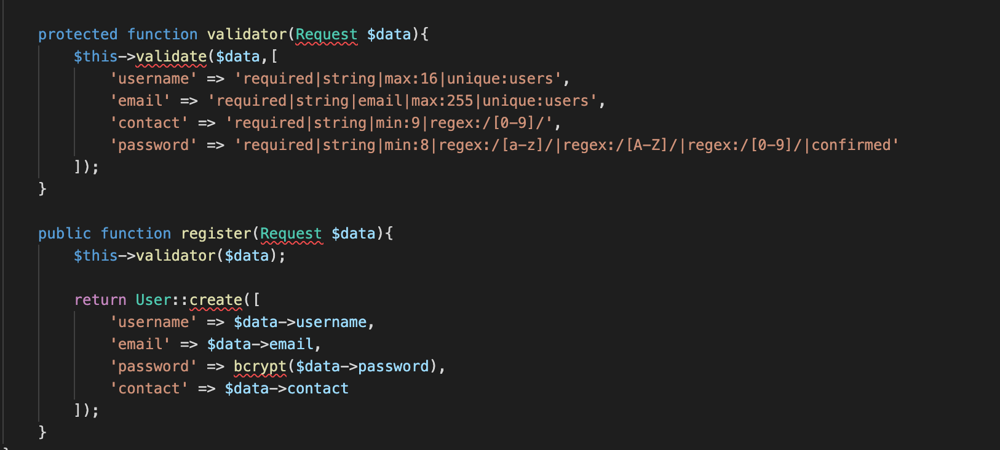

# **PA: Apresentação do Produto**

Este projeto consiste na criação de um website no âmbito do projeto de LBAW sobre **Collaborative News**, onde cada pessoa pode ler, publicar ou até comentar notícias, desde que seja possuidor de uma conta e ajudando a evitar assim a circulação de fake news pelos utilizadores.

Neste contexto criamos O Ardina para promover um site de partilha de notícias e onde qualquer pessoa pode usufruir e partilhar aquilo que se passa pelo mundo fora.

## **A9: Produto**

### **1.Instalação**

- Versão Final do Código em : <https://git.fe.up.pt/lbaw/lbaw2122/lbaw2163/-/tree/main/OArdina>
- Docker command para correr o código: `docker run -it -p 8000:80 --name=lbaw2163 -e DB_DATABASE="lbaw2163" -e DB_SCHEMA="lbaw2163" -e DB_USERNAME="lbaw2163" -e DB_PASSWORD="pQSjdPPi" git.fe.up.pt:5050/lbaw/lbaw2122/lbaw2163`

### **2.Uso do Website**

Link para o site : <http://lbaw2163.lbaw.fe.up.pt>

#### **2.1. Credenciais de Administrador**

| Username | Password |
| -------- | -------- |
| admin    | test1234 |

#### **2.2. Credenciais de Utilizador**

| Username  | Password |
| --------- | -------- |
| Antonio   | test1234 |
| Patricia  | test1234 |
| Edgar     | test1234 |
| Manuel    | test1234 |

### **3. Ajuda na Aplicação**

O site OArdina é bastante intuitivo na sua utilização mas caso surja alguma dúvida pertinente pode sempre dirigir-se ao rodapé do nosso website e irá encontrar duas páginas, a **FAQ** onde irá obter um conjunto de perguntas e resposta onde poderá encontrar a solução para as dúvidas e a página **Sobre Nós** onde irá encontrar os 4 contactos e utilizar cada um para contactar de forma a resolver a dúvida rapidamente.

- **Rodapé**

- **FAQ**

- **Sobre Nós**

### **4. Validação de Input**

A validação de input é efetuada para assegurar que são inseridos apenas os dados pretendidos pelo site de forma a evitar informação maliciosa e desta forma integrar o workflow do sistema de informação. Para isto decidimos usar, dividindo as validações na forma *client-side* e *server-side*, cada um no seu contexto. Sabendo que através de JavaScript o utilizador pode realizar um *bypass* e desativar o JavaScript ou usar um *web proxy*. Para confirmação que não ocorre isso fazemos a validação do cliente também do lado do servidor através do *Validator*.

#### Exemplo de Validação

##### Client-Side

##### Server-Side

**Validação do *Client-Side* :**

- Campos requeridos
- Validação Sintática
- Multi-purpose Internet Mail Extensions

**Validação do *Server-Side* :**

Esta validação presente no OArdina através da função existe no **Laravel** que é o [laravel validator](https://laravel.com/docs/8.x/validation) para assegurar a validação via HTML. Em adição a isso também adicionamos em algumas rotas o [laravel policies](https://laravel.com/docs/8.x/authorization).

### **5. Check de Usabilidade e de Acessibilidade**

#### Checklist Acessibilidade

A checklist pode ser encontrada aqui : [Acessibilidade](Acessibilidade.pdf) ou aqui [Acessibilidade](https://drive.google.com/file/d/1LrdnPy4I_ugrKLgHl87DuwyiNIWG2i6z/view?usp=sharing)

#### Checklist Usabilidade

A checklist pode ser encontrada aqui : [Usabilidade](Usabilidade.pdf) ou aqui [Usabilidade](https://drive.google.com/file/d/18tYEmUq1ukxokLtgyGypY-Jt7bdbmhne/view?usp=sharing)

### **6. HTML&CSS Validação**

Todo o código HTML e CSS foi validado, assim sendo temos todo o *website* validado conformes as normas de HTML e CSS como nos exemplos mostrados em seguida.

- [HTML Validation](HTML.png) ou aqui [HTML Validation](https://drive.google.com/file/d/1emy7_GHPG9Qrn7z8CeD0PeJN4w_v8Wa3/view?usp=sharing)

- [CSS Validation](CSS.png) ou aqui [CSS Validation](https://drive.google.com/file/d/12XI0W6LEJG8fGQTlzJXbEgtgqx45kSOB/view?usp=sharing)

### **7. Revisões ao Projeto**

#### **7.1. User Stories**

- Adição do reportar notícia.
- Adição do gerir reportes por parte da administração.
- Adição da gestão de notificações.

#### **7.2. Base de Dados**

- Tradução da base de dados para inglês para facilitar o uso da mesma com as funções do Eloquent.
- Adição e correção de triggers que não estavam a funcionar corretamente.
- Criação da tabela content para facilitar o manuseamento do conteúdo do site.

### **8.Detalhes da Implementação**

#### **8.1. Livrarias Usadas**

- Mailtrap - Usado para fazer a recuperação de palavra-passe.
- Bootstrap: A open-source para trabalhar com HTML, CSS, and JS.
- Laravel: a PHP Framework para Web Artisans.

#### **8.2. User Stories**

##### **M01 - Autenticação e Perfil Individual**

|Identificador US|Nome|Prioridade|Membro da Equipa|Estado|
| -------- | -------- | -------- | -------- | -------- |
|US09|Sign-In|Alta|Edgar Lourenço|100%|
|US10|Sign-Up|Alta|Patrícia Vieira|100%|
|US22|Sign-Out|Alta|Patrícia Vieira|100%|
|US11|Recuperar Password|Alta|Edgar Lourenço|80%|
|US21|Ver/Editar Perfil|Alta|Edgar Lourenço|100%|

##### **M02 - Criar/Editar Notícia/Comentário**

|Identificador US|Nome|Prioridade|Membro da Equipa|Estado|
| -------- | -------- | -------- | -------- | -------- |
|US15|Criar Notícia|Alta|António Campelo|100%|
|US29|Editar Notícia|Alta|António Campelo|100%|
|US30|Remover Notícia|Alta|Manuel Sá|100%|
|US16|Criar Comentário|Alta|Manuel Sá|100%|
|US31|Editar Comentário|Alta|Patrícia Vieira|100%|
|US32|Remover Comentário|Alta|Edgar Lourenço|100%|

##### **M03 - Ver Utilizadores/Conteúdo**

|Identificador US|Nome|Prioridade|Membro da Equipa|Estado|
| -------- | -------- | -------- | -------- | -------- |
|US13|Ver Notícia|Alta|Edgar Lourenço|100%|
|US01|Ver o Feed de Notícias Principais|Alta|António Campelo|100%|
|US02|Ver o Feed de Notícias Recentes|Alta|Manuel Sá|100%|
|US20|Classificar Notícias/Comentários|Alta|Patrícia Vieira|100%|
|US23|Ver Perfil de Outro Utilizador|Alta|Manuel Sá|100%|
|US17|Ver Categorias|Alta|Patrícia Vieira|100%|
|US24|Reportar Utilizador/Comentário|Média|Edgar Lourenço|100%|
|US25|Follow/Unfollow Utilizadores|Média|António Campelo|100%|
|US28|Ver estatisticas|Média|Manuel Sá|100%|

##### **M04 - Procura Utilizadroes/Conteúdo**

|Identificador US|Nome|Prioridade|Membro da Equipa|Estado|
| -------- | -------- | -------- | -------- | -------- |
|US05|Pesquisar por notícias e comentários|Alta|Patrícia Vieira|100%|
|US19|Pesquisar Notícias/Comentários ou Utilizadores|Alta|Edgar Lourenço|100%|
|US27|Filtrar Notícias|Média|Edgar Lourenço|100%|

##### **M05 - Notificações**

|Identificador US|Nome|Prioridade|Membro da Equipa|Estado|
| -------- | -------- | -------- | -------- | -------- |
|US42|Ver Notificações|Alta|Edgar Lourenço|100%|
|US43|Ver Pedidos Administração|Alta|Patrícia Vieira|100%|

##### **M06 - Pedidos Administração**

|Identificador US|Nome|Prioridade|Membro da Equipa|Estado|
| -------- | -------- | -------- | -------- | -------- |
|US44|Reportar Notícia|Alta|Manuel Sá|100%|
|US24|Reportar Utilizador/Comentário|Média|Edgar Lourenço|100%|

##### **M07 - Administração do Admin**

|Identificador US|Nome|Prioridade|Membro da Equipa|Estado|
| -------- | -------- | -------- | -------- | -------- |
|US34|Ver reportes|Alta|António Campelo|100%|
|US35|Ban/Unban Utilizador|Alta|Edgar Lourenço|100%|
|US36|Remover Utilizador|Alta|Patrícia Vieira|100%|
|US37|Remover Comentários Impróprios|Alta|Manuel Sá|100%|
|US38|Remover Notícia|Média|Edgar Lourenço|100%|
|US39|Adicionar FAQ|Média|Patrícia Vieira|100%|
|US40|Remover FAQ|Média|Patrícia Vieira|100%|
|US41|Rever Notícia|Baixa|António Campelo|100%|

##### **M08 - Páginas Estáticas**

|Identificador US|Nome|Prioridade|Membro da Equipa|Estado|
| -------- | -------- | -------- | -------- | -------- |
|US07|FAQ Page|Média|António Campelo|100%|
|US08|Sobre Nós|Média|Edgar Lourenço|100%|

## **A10: Apresentação**

Este artefacto inclui a promoção, a apresentação e a demonstração do projeto.

### 1. Apresentação do Projeto 

Este projeto consiste na criação de um website que contém uma plataforma de gestão de notícias. O público-alvo desta plataforma são pessoas com interesse em ler, criar e partilhar artigos, independentemente do seu tema.
A nossa intenção é conseguir trazer muita informação e laços sociais a uma nova comunidade criada por esta plataforma. É uma das melhores maneiras de nos mantermos informados acerca não só do que nos rodeia como também das comunidades e assuntos que, embora mais distantes, são igualmente interessantes e importantes para a construção de um futuro melhor.
Os objetivos principais desta plataforma é dar aos utilizadores a oportunidade de partilhar e ler notícias que sejam do seu interesse, tal como a interação deste com tais notícias, seja ela em forma de comentários, votos, etc. O utilizador poderá também seguir outros utilizadores e/ou temas que sejam relevantes para si. Estes são fundamentais para que esta seja uma plataforma útil e eficiente para os seus utilizadores. Para que seja um sistema colaborativo, a interação dos utilizadores sobre todo o conteúdo e sobre outros utilizadores é imperativo. O sistema de votação é uma boa maneira de destacar conteúdo valioso.
Este utilizador poderá editar e eliminar as suas notícias, comentários e votos, tal como reportar conteúdo de outros utilizadores. Poderá também alterar a sua password, nickname e foto de perfil.
Um utilizador com estatuto de administrador será também capaz de eliminar todo tipo de conteúdo, sendo o autor deste conteúdo notificado com a respetiva justificação. Será o administrador também o responsável por gerir reportes efetuados, podendo, se se justificar, eliminar o conteúdo reportado.

URL para o produto : <http://lbaw2163.lbaw.fe.up.pt>

## 2. Apresentação do Vídeo

O vídeo de apresentação ao nosso projeto está disponível : [Ardina](https://drive.google.com/drive/u/1/folders/1-fPoSR3lXyPI38UgpWf6iQBe2Lk_ckoT)

**_Grupo 63, Data :_** 09/11/2021

* António Ferreira Cabral de Barbosa Campelo ,[up201704987@fc.up.pt](mailto:up201704987@fc.up.pt)
* Edgar Miguel Pinto Lourenço ,[up201604910@fc.up.pt](mailto:up201604910@fc.up.pt)
* Manuel da Silva Sá ,[up201805273@fc.up.pt](mailto:up201805273@fc.up.pt)
* Patrícia Daniela Tavares Vieira ,[up201805238@fc.up.pt](mailto:up201805238@fc.up.pt)

**Em termos de edição, todos os elementos colaboraram, portantos consideramos que os 4 são editores do documento**